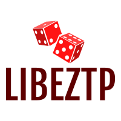

# EZ Tabletop Library

##### Jump To
 * [FAQ](#faq)
 * [Requirements](#requirements)
 * [Compiling](#compiling)
 * [Using](#using)
 * [License](#license)

## FAQ
#### What is LIBEZTP?
LIBEZTP is a C++ library aimed at create an easy to use library for tabletop game adaptations made in C++.
It has the necessary features to make and manage characters, items, and races in an easy format.
This is mostly because I plan on making some DM tools and one universal library would be pretty slick.

#### Where did the code for LIBEZTP come from?
I tried to make a Server-Client D&D application in mostly headers.
I failed miserably and rebranded it as a D&D framework, but a lot of the code was actually decent.
I'm using this to fix the mistakes I made and make it an actual usable library.

However, a lot of the code that is soon to come will be all fresh!

## Requirements
 * C++17 capable compiler (gcc, clang, msvc)
 * CMake 3.10 or above
 * [Nlohmann JSON](https://github.com/nlohmann/json) for serialization

## Compiling
 1. Clone the git repo
 2. In the cloned repo root directory, type
 
    ```bash
    mkdir build
    cd build
    cmake ..
    make
    make install
    ```
    
    This will create a new directory called `build` that will hold all your build files.
    It will them use cmake to compile the files and create the library file.
    With this done, it will install the library files and headers into their respective spots.
    
 3. If you wish to verify that the files worked, in build you may type
    
    ```bash
    cd test
    ./test
    ```
    
    This will navigate into the directory that has test, and run the Catch2 tests.
    It should very plainly tell you which tests succeeded and failed.
    If any failed, please make an issue request on the GitHub.

## Using
As this project (quite recently) is attempting to use modern C++, the only way to use this project aside from moving all source files into your project is with `find_package` on CMake.
To use, install as shown above, and then add the following to your `CMakeLists.txt`

```cmake
find_package(LibEZTP)

#All the fun stuff with your executable

target_link_libraries(YourExecutable PRIVATE LibEZTP::LibEZTP)
```

If you installed properly, it's as simple as that.
Only two lines you need to add!

## License
Copyright (C) 2020  [Gabriele Alessandro Ron](https://macr0nerd.github.io)

This program is free software: you can redistribute it and/or modify
it under the terms of the GNU General Public License as published by
the Free Software Foundation, either version 3 of the License, or
(at your option) any later version.

This program is distributed in the hope that it will be useful,
but WITHOUT ANY WARRANTY; without even the implied warranty of
MERCHANTABILITY or FITNESS FOR A PARTICULAR PURPOSE.  See the
GNU General Public License for more details.

You should have received a copy of the GNU General Public License
along with this program.  If not, see <http://www.gnu.org/licenses/>.

***

This class contains the JSON Parser from Niels Lohmann which is licensed under the [MIT License](https://opensource.org/licenses/MIT). Copyright © 2013-2019 [Niels Lohmann](http://nlohmann.me/)

This class contains the Catch2 Testing Library from Catch Org which is licensed under the [Boost License](https://opensource.org/licenses/BSL-1.0). Copyright © 2012-2020 [Catch Org](https://github.com/catchorg)